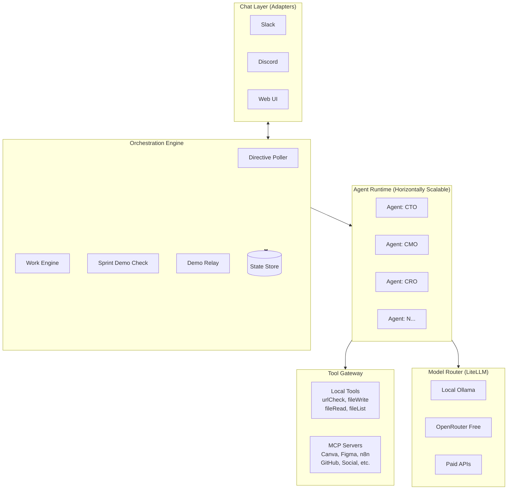
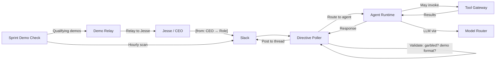
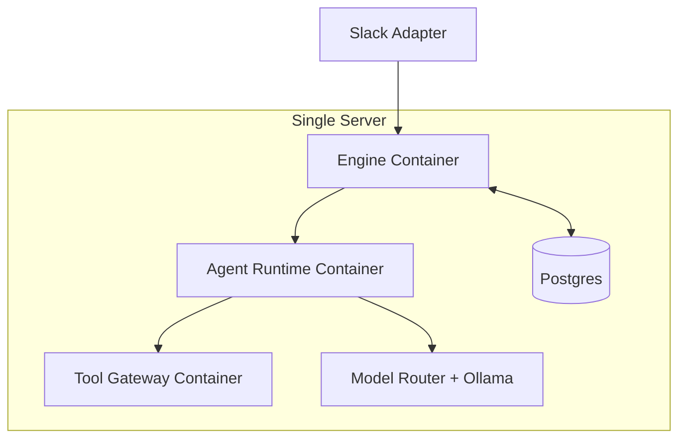
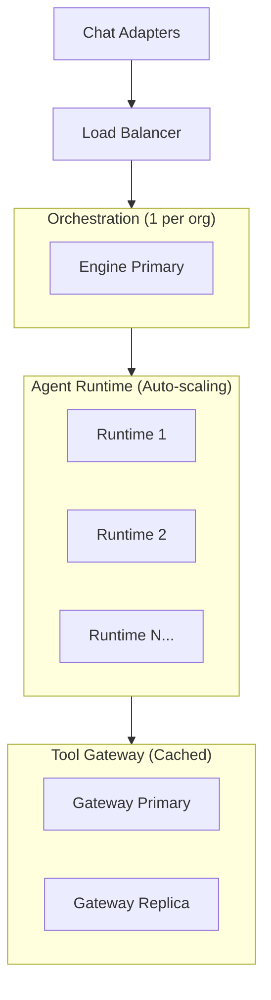

# MACF Architecture

**Multi-Agent Communications Framework** — a layered, open-source toolkit for running a persistent AI team across multiple platforms (Slack, Cursor, Claude Desktop, Discord, Teams, …) with shared memory, shared agent personalities, and swappable AI/memory backends.

---

## Design Philosophy

The architecture is built like Lego: each layer has one job and exposes a clean interface so that any piece can be swapped or extended without touching the others.

```
┌─────────────────────────────────────────────────────────────┐
│                     PLATFORM ADAPTERS                        │
│   slack/   │   mcp/   │   discord/   │   teams/  │  …       │
├─────────────────────────────────────────────────────────────┤
│                        CORE LAYER                            │
│   agents (config)  │  AI backends  │  memory backends       │
└─────────────────────────────────────────────────────────────┘
```

1. **Core** — platform-agnostic. Agent definitions, AI backend abstraction, memory backend abstraction. No Slack, no HTTP servers, no platform imports.
2. **Adapters** — platform-specific. Each adapter knows how to receive messages from its platform and call into core. An adapter is the thinnest possible glue layer.
3. **Apps** — deployable entry points. `slack-agents/` is the production Slack app today. Future apps live alongside it.

---

## Repository Layout

```
MultiAgentCommsFramework/
│
├── core/                         # Platform-agnostic shared logic
│   ├── config.js                 # Agent definitions (single source of truth)
│   ├── ai/
│   │   ├── interface.js          # AI backend factory
│   │   ├── anthropic.js          # Claude (Anthropic) backend
│   │   ├── perplexity.js         # Perplexity backend (stub → swap in)
│   │   └── <vendor>.js           # Drop in any future backend here
│   └── memory/
│       ├── index.js              # Memory backend factory
│       ├── filesystem.js         # Default: local JSON files (Railway volume / /tmp)
│       ├── upstash.js            # HTTP Redis — cross-platform shared state
│       └── sqlite.js             # SQLite — single-machine multi-process
│
├── adapters/                     # One directory per platform
│   ├── mcp/                      # Cursor / Claude Code / Claude Desktop
│   │   ├── index.js              # MCP server (stdio transport)
│   │   └── package.json
│   ├── slack/                    # (future migration target for slack-agents/)
│   └── discord/                  # (future)
│
├── slack-agents/                 # Current production Slack app (Railway)
│   ├── index.js                  # Bolt Socket Mode entry point
│   ├── config.js                 # Slack-specific agent config (migrating to core/)
│   ├── agents/                   # One file per agent role
│   │   ├── execPM.js
│   │   ├── cmo.js
│   │   ├── cco.js
│   │   ├── cro.js
│   │   ├── cfo.js
│   │   ├── lawyer.js
│   │   ├── jobcoach.js
│   │   └── cuxo.js
│   └── utils/
│       ├── anthropic.js          # generateReport() — human-voice wrapper
│       ├── delegation.js         # relay() + stripDelegations()
│       ├── state.js              # Filesystem agent memory
│       └── proactive.js          # Scheduled proactive posts
│
├── .github/
│   └── workflows/
│       ├── slack-agents-ci.yml   # Unit tests on every PR
│       └── smoke-test.yml        # Live E2E test after Railway deploy
│
├── package.json                  # Root workspace (Node ≥18)
└── ARCHITECTURE.md               # This document
```

---

## Core Layer

### Agent Definitions (`core/config.js`)

All agent roles live here. Each entry has:

| Field | Purpose |
|---|---|
| `id` | Stable identifier used across all platforms |
| `systemPrompt` | The agent's persona and instructions |
| `primaryChannel` | Where the agent naturally posts (Slack channel ID, or logical name) |
| `slackName` / `emoji` | Slack-specific display fields (adapters can ignore these) |

Adding a new agent = one new entry in `AGENTS`. Every platform adapter picks it up automatically.

### AI Backend Factory (`core/ai/interface.js`)

```
AI_BACKEND env var  →  createAIBackend()  →  { generateReport, chat }
```

All backends expose the same interface:

```js
// Every AI backend must implement:
generateReport({ systemPrompt, context, maxTokens }) → Promise<string>
chat({ systemPrompt, userMessage, maxTokens })       → Promise<string>
```

**Switching AI backends:** set `AI_BACKEND=perplexity` (or `anthropic`, or any registered name) in your `.env`. No agent code changes required.

**Adding a new AI backend:**
1. Create `core/ai/<vendor>.js` implementing the interface above.
2. Add a `case` to the switch in `core/ai/interface.js`.
3. That's it.

### Memory Backend Factory (`core/memory/index.js`)

```
MEMORY_BACKEND env var  →  createMemoryBackend()  →  { get, set, push, dump, loadAll, … }
```

All backends expose the same interface (mirrors `slack-agents/utils/state.js`):

```js
get(agentId, keyPath)             → value
set(agentId, keyPath, value)      → void
push(agentId, keyPath, value)     → void
dump(agentId)                     → object   // full agent state snapshot
loadAll()                         → void     // warm up cache on startup
```

| Backend | Best for |
|---|---|
| `filesystem` | Default. Single-process Railway deploy, local dev. |
| `upstash` | **Cross-platform shared memory.** Railway Slack bot + local Cursor MCP share the same state over HTTP. Requires `UPSTASH_REDIS_REST_URL` + `UPSTASH_REDIS_REST_TOKEN`. |
| `sqlite` | Multi-process single machine, fast local reads. |

**Shared memory across platforms** (Slack + Cursor reading the same agent state):

```
Railway (Slack bot)         Your laptop (Cursor MCP)
       │                              │
       └────────────┬─────────────────┘
                    ▼
           Upstash Redis (HTTP)
           macf:{agentId}:{key}
```

Set `MEMORY_BACKEND=upstash` and the same `UPSTASH_*` env vars on both Railway and locally, and all agents share one memory regardless of which platform they're called from.

---

## Adapters

### MCP Adapter (`adapters/mcp/`)

Exposes the entire agent team as MCP tools consumable by any Claude-based coding assistant (Cursor, Claude Code CLI, Claude Desktop).

**Tools exposed:**

| Tool | Agent |
|---|---|
| `ask_exec_pm` | Exec PM — always start here |
| `ask_cmo` | CMO — marketing strategy |
| `ask_cco` | CCO — content drafting |
| `ask_cro` | CRO — research |
| `ask_cuxo` | CUXO — UX/design |
| `ask_lawyer` | Lawyer — legal guidance |
| `ask_cfo` | CFO — financial strategy |
| `ask_jobcoach` | Job Coach — career strategy |
| `ask_team` | Routes through Exec PM |

**Installing in Claude Code:**
```bash
claude mcp add macf-team -- node /path/to/MultiAgentCommsFramework/adapters/mcp/index.js
```

**Installing in Cursor / Claude Desktop** (`~/.cursor/mcp.json` or `~/.claude.json`):
```json
{
  "mcpServers": {
    "macf-team": {
      "command": "node",
      "args": ["/path/to/MultiAgentCommsFramework/adapters/mcp/index.js"],
      "env": {
        "ANTHROPIC_API_KEY": "sk-ant-...",
        "MEMORY_BACKEND": "upstash",
        "UPSTASH_REDIS_REST_URL": "https://...",
        "UPSTASH_REDIS_REST_TOKEN": "..."
      }
    }
  }
}
```

The MCP adapter reuses the same `core/config.js` agent definitions, same AI backend, same delegation relay, and same memory — it's just a different transport (stdio JSON-RPC instead of Slack events).

### Slack App (`slack-agents/`)

Currently the production app. Runs on Railway with Bolt Socket Mode. Each agent file handles:
- `handleMention(text, say, context)` — responds when @mentioned or called in its channel
- `handleDelegation(text, fromAgent, visitedAgents)` — responds to in-process delegation from Exec PM

**Delegation flow:**

```
Jesse → #management → Exec PM
                          │ [from: Exec PM → CMO]
                          ├──────────────────────→ CMO processes in-process
                          │ [from: Exec PM → CRO]
                          └──────────────────────→ CRO processes in-process
                                                        │
Exec PM aggregates ←──────────────────────────────────┘
Jesse sees one response from Exec PM only
```

`stripDelegations()` removes `[from: X → Y]` lines from anything displayed to Jesse. The delegation relay sees the full text before stripping.

### Adding a New Platform Adapter

1. Create `adapters/<platform>/index.js`.
2. Import from core: `require('../../core/config')`, `require('../../core/ai/interface')`, `require('../../core/memory/index')`.
3. Import the delegation relay: `require('../../slack-agents/utils/delegation')` (will move to `core/` in a future PR).
4. Implement platform-specific message receipt and call `orchestrate(agentId, message)` — the same pattern as `adapters/mcp/index.js`.
5. No changes required to any agent definitions, AI backends, or memory backends.

**Discord** example entry point would be `adapters/discord/index.js` using `discord.js`. Same team, same memory, different wire protocol.

---

## CI / Quality

### Unit Tests (`slack-agents-ci.yml`)
Runs on every PR that touches agent code. Executes `npm test` in `slack-agents/`.

### Live Smoke Test (`smoke-test.yml`)
Runs after every push to `main`. Sequence:

```
push to main
    │
    ├── wait 120s (Railway deploys)
    │
    ├── POST /chat.postMessage to #management
    │     "exec-pm: smoke test ping {sha} — please acknowledge"
    │
    ├── wait 30s
    │
    ├── GET /conversations.history — check for bot_message reply
    │
    └── POST result back to #management
```

**Required GitHub secrets:**
- `SLACK_BOT_TOKEN` — bot token with `chat:write` + `channels:history`
- `SLACK_MANAGEMENT_CHANNEL_ID` — channel ID (e.g. `C0ASH4TF604`)

---

## Environment Variables

| Variable | Default | Purpose |
|---|---|---|
| `ANTHROPIC_API_KEY` | required | Anthropic Claude API key |
| `SLACK_BOT_TOKEN` | required for Slack | Slack bot OAuth token |
| `SLACK_APP_TOKEN` | required for Slack | Slack Socket Mode app token |
| `AI_BACKEND` | `anthropic` | AI provider: `anthropic` \| `perplexity` |
| `ANTHROPIC_MODEL` | `claude-opus-4-5` | Model override |
| `MEMORY_BACKEND` | `filesystem` | State backend: `filesystem` \| `upstash` \| `sqlite` |
| `UPSTASH_REDIS_REST_URL` | — | Required for `upstash` backend |
| `UPSTASH_REDIS_REST_TOKEN` | — | Required for `upstash` backend |
| `RAILWAY_VOLUME_MOUNT_PATH` | `/tmp` | Filesystem backend root on Railway |

---

## Running Locally

```bash
# Slack bot
cp .env.example .env   # fill in keys
npm run start:slack

# MCP server (for Cursor / Claude Code)
cd adapters/mcp && npm install
npm run start:mcp

# Tests
npm test
```

---

## Roadmap

- [ ] Migrate `slack-agents/utils/delegation.js` → `core/delegation.js`
- [ ] Migrate `slack-agents/config.js` → fully replaced by `core/config.js`
- [ ] Move Slack app to `adapters/slack/` to mirror the MCP adapter layout
- [ ] `adapters/discord/` — Discord adapter
- [ ] `adapters/teams/` — Microsoft Teams adapter
- [ ] `core/ai/openai.js` — OpenAI/GPT backend
- [ ] `core/ai/perplexity.js` — complete Perplexity Sonar implementation
- [ ] Web dashboard for memory inspection and agent health
- [ ] Agent-to-agent async messaging via shared memory (so Cursor delegations leave persistent traces)

---

## Contributing

This is an open-source project. The core layer is intentionally dependency-free (only Node built-ins) so it can be bundled into any runtime. Each adapter declares its own `package.json` with only the deps it needs. PRs that keep this layering clean are warmly welcomed.

---

## Product Architecture (Oct 2026)

How everything fits together as one system — from single-server self-hosted to distributed enterprise.

### Three Layers



**Layer responsibilities:**

1. **Orchestration Engine** — directives, task routing, state, scheduling. The brain. One instance per organization. Coordinates; doesn't do the work.
2. **Agent Runtime** — agents are *configurations*, not code. Shared runtime scales horizontally. Add agents via YAML config, no deploys.
3. **Tool Gateway** — all capabilities in one place. Local tools + MCP servers. Per-role permissions enforced.

### Directive Flow



### Scaling: Single Server

Docker Compose. All layers on one machine. For individuals and small teams.



### Scaling: Distributed

Each layer scales independently.



| Layer | Scaling | Notes |
|-------|---------|-------|
| Orchestration Engine | 1 per org | Coordinator, not worker. State in Postgres. |
| Agent Runtime | Horizontal (N) | Agents are configs. Add without deploys. |
| Tool Gateway | Horizontal + cache | MCP servers pooled. Rate limits per role. |
| Model Router | Config change | Swap LiteLLM backends. No code change. |
| Chat Adapters | 1 per platform | Thin, stateless translation. |

### Agent Configuration Model

```yaml
# agents/cto.yaml — adding an agent = adding a file
id: cto
role: Chief Technology Officer
system_prompt: "You are the CTO..."
tools:
  - urlCheck
  - fileWrite
  - mcp:github
  - mcp:n8n-mcp
model_tier: smart
channels: ["#management"]
demo_standard: true
```

---

## Testing Contract (BDD/TDD)

Every layer ships with tests. No exceptions.

### Unit Tests (TDD — `engine/tests/`)

| Module | What it proves |
|--------|---------------|
| `agentTools` | Path traversal blocked, timeouts enforced, sandbox isolation |
| `demoRelay` | Only label+link+task demos relayed; everything else rejected |
| `demoStandard` | Garbled output detected; clean output passes |
| `sprintDemo` | Joint-task coverage, streak reset, escalation dedupe |

Run: `cd slack-agents && npx jest engine/tests --forceExit`

### Integration Tests

- Directive → agent → tool → response → Slack post (end-to-end)
- Demo relay: qualifying demo reaches Jesse within 1 hour; non-qualifying doesn't
- Tool gateway: MCP server reachable through per-role grants

### BDD Feature Tests

```gherkin
Feature: Agent demo delivery
  As Jesse
  I want clickable demos from my agents
  So I can verify their work

  Scenario: Agent produces qualifying demo
    Given an agent completes a task
    When the agent posts a demo with label, link, and task ref
    Then the demo relay surfaces it to Jesse within 1 hour

  Scenario: Agent produces non-qualifying output
    Given an agent posts a status update without a link
    When the demo relay scans Slack
    Then the output is NOT relayed to Jesse

  Scenario: Agent uses tools to build artifact
    Given a CTO delegation requiring a real artifact
    When the agent invokes fileWrite via the tool gateway
    Then the artifact exists in the sandbox
    And the demo references the artifact link
```

### Quality Gates

- New tool: unit tests + sandbox escape tests before merge
- New agent config: demo standard validation before activation
- New MCP server: grant mapping + connectivity test before agents can use it
- Every PR: `npx jest` must pass; BDD scenarios must pass
